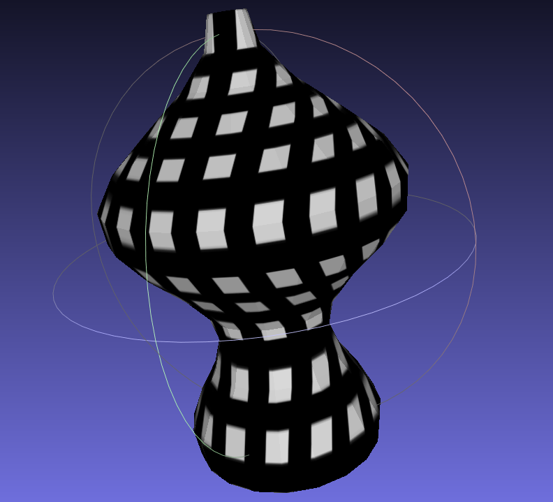

GEOMETRY FROM SILHOUETTE
========================

This repository contains a very simple script for generating a triangle mesh of a solid of revolution, described by a given sampled silhouette. 
This silhouette must be provided as list of values within [0,1) and the number of items in the list (i.e., sampling rate) determines the number of vertical mesh segments. 
The radial sampling rate can be provided as optional parameter.

The generated texture file constitutes a mask indicating which areas are used in the 3D shape. To add a specific texture to the shape, this area can be modified accordingly. 
Note, that UV space coordinates are defined such that they form a coherent region in the texture file. As a consequnce, the resulting texture on the 3D mesh is subjected to distortion which increases with increasing distance from the texture's midpoint in horizontal direction. 

## Usage

The script can be called like this:
```bash
python3 geometry-from-silhouette.py -c SILHOUETTE_FILE -t TEXTURE_FILE -o OUTPUT_FILE [--radial-segments=NUM_R_SEGMENTS] [--texture-vpixels=NUM_VERTICAL_TEXTURE_PIXELS]
```
Also see the simple example in `test.sh`. 


